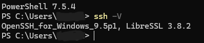

# Tutorial:

This document tries to explain the method of installing / setting-up the Server RelayX for the RelayX network. 

Our RelayX network is alive because of volunteers like you. Thank you.

# Step 0. Pre Requisites :
 Step 1.1 - Must have set-up Ubuntu Server LTS or non-LTS Operating system

# Step 1. SSH :
For clear output and copy-pasting capabilities, use a device with GUI and check SSH
```
ssh -V
```
If it shows 


# Step 2. Git
Skip if you're coming after doing the README.md steps

 Install Git (Version control) :
 ```
 sudo apt install git
 ```
 Clone the repo by :
 ```
 git clone https://github.com/Poojit-Matukumalli/Project-RelayX-Setup.git
 ```

# Step 3. Running Auto-Setup:
After cloning, run:
```
cd Project-RelayX-Setup && ls
```
Verify if relay_setup.sh is in the folder.

If yes, run:
```
chmod +x relay_setup.sh
```
Finally, run the bash script:
```
./relay_setup.sh
```
# The Relay setup happens automatically. If any prompts are asked, Type "y". You are free to read what it is asking for.

## Step 4. Fetching onion address :
Run :
To fetch tor hostname / onion address, Run:
```
sudo cat /var/lib/tor/<your sudo profile username>/hostname
```
# Step 5. Verification:

To Ensure its working, Go to the main repo (Link in [README.md](README.md)) and use the Client_RelayX to test relay connectivity.

## Note :
If anything fails during setup, Please email me with clear screenshots from your device using SSH. Capture the errors properly.

Thank You.