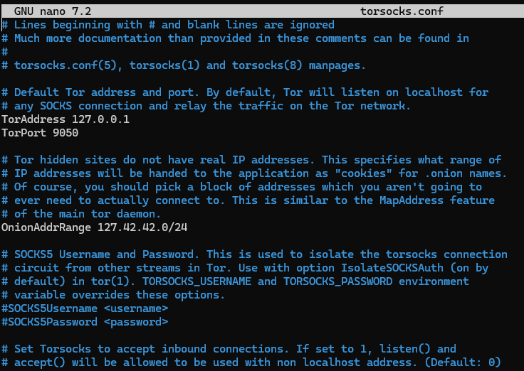
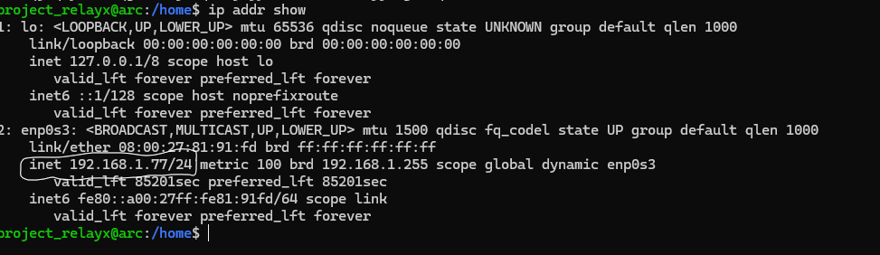
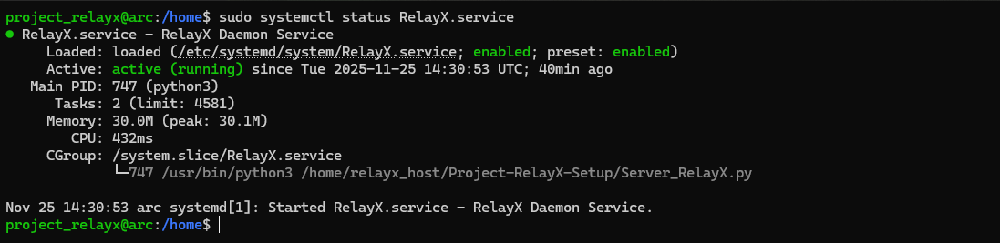
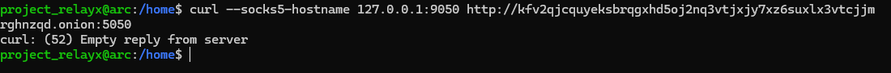

# Tutorial :
## Note :
If anything Fails during this Setup process, Email me at projectrelayx@gmail.com

Reach out casually or if reaching out with any issues, Summarize your error in the Subject line and send detailed screenshots of the issues. I'll respond right away. Thank you.
# Step 1. Pre-Requisite Installs :

1.1. Setup a device with Ubuntu server LTS on it.

1.2. During the setup, You could (optional) name the Relay as 'project_relayx' or 'relayx_maintainer'

1.3 Set-Up a non-sudo user profile by running
```
sudo adduser relayx_host
```
Name the Non-Sudo profile relayx_host (Uses this name for the commands below)
1.4. After Setup, run 
```
sudo apt update && sudo apt upgrade
```

# step 2. Installing Dependencies :

## 2.1. Python

   Import deadsnakes repository for new python versions (as of Nov 2025)
   ```
   sudo add-apt-repository ppa:deadsnakes/ppa
   ```
   ```
   sudo apt update
   ```
   ```
   sudo apt install python3.13 pip3 nano 
   ```
   Add your desired version after python<'version'>.
   Format: pythonX.Y where X is the generation and Y is the update. 
   (ex: python3.13, Where 3 is the generation and .13 is the update version)

   Verify python installation :
   ```
   python3 --version
   ```
## 2.2. Tor

   The networking capabilities of Tor is used, Credits in CREDITS.md

   Install Tor :
   ```
   sudo apt install tor
   ```
   Enable and start Tor service :
   ```
   sudo systemctl enable tor
   ```
   ```
   sudo systemctl start tor
   ```
   Verify the installation :
   ```
   sudo systemctl status tor
   ```
   If it shows this, Tor is active. 

   

## 2.3. aiohttp-socks :
   This is a python module with SOCKS connectivity features.

   Install aiohttp-socks :
   ```
   pip3 install aiohttp-socks
   ```
   If that doesn't work, try
   ```
   sudo apt install python3-aiohttp-socks
   ```

## 2.4. Git :
   If you're coming from README.md of this repo, skip this step.

   Git is a version control tool. Use it to copy theprojectrepo.
x
   To Install :
   ```
   sudo apt install git
   ```
   To Verify :
   ```
   git --version
   ```
   To clone the repository :
   ```
   git clone https://github.com/Poojit-Matukumalli/Project-RelayX-Setup.git
   ```
## 2.5. Testing software :
   To test the relay connection, several tools will be used. Run this command.
   ```
   sudo apt install torsocks
   ```
   Normally, torsocks resolves DNS resolution through tor, if you face any issues, (Your relay can't be tested properly.) edit the .conf files by running :
   ```
   sudo nano /etc/tor/torsocks.conf
   ```
   In this file :

   Uncomment the line that says 'AllowInBound 1'

   Comment the line that says 'OnionAddrRange'

   The final file should look like this

   

## 2.6. curl
   Verify if curl came with your installation :
   ```
   curl --version
   ```
   If it says 'curl: command not found'

   Run :
   ```
   sudo apt install curl
   ```
   Then rerun the 'Verify' step.

# Important : Use ssh
To check, Run :
```
sudo systemctl status ssh
```
If it says Inactive / Dead, run :
```
sudo systemctl enable ssh && sudo systemctl start ssh
```
## Uses of ssh (Skip if you know)
ssh allows users to connect their pcs over LAN. It can be helpful for diagnosing errors.
after enabling ssh, connect it (command given below) on a device with a GUI terminal for ease of access & copy paste capabilities.

## Connecting via ssh :
Run on a device with a GUI terminal. Exclude the /24 at the end.
That /24 is the subnet mask which isn't needed / can be safely ignored.

Check ip by running :
```
ip addr show
```
(Usually on Number 2), and note the ip under enp0s3. Ignore the ones that say something like 'lo'.
The ip format should be someting like 192.168.x.xx/24, under inet. Note that ip.

)

In my case, username is projectrelay x, and ip is 192.168.1.xx

Connect to SSH :
```
ssh <username>@<ip_address>
```
For example :

```
ssh project_relayx@192.168.1.77
```
This is an example using my case. Can vary.

---
# Step 3. Daemon Setup
Overview :

Assuming a perfect Tor install, 
Configure Python and tor to use the second non-sudo profile you created.
## Moving Server_RelayX.py file :
Move the file from the sudo profile to the non sudo profile.

Run :
```
sudo cp /home/Project-RelayX-Setup /home/relayx_host
```
Switch to the Non-Sudo profile to ensure the Copy-Paste succeeded.

Run:
```
su - relayx_host
```
After switching, Run :
```
ls
```
It should show the folder in the Non-Sudo profile.

Switch back to the sudo profile, Run :
```
su - <your username>
```
Enter your sudo profile's username there

---
## 2. Setting up Daemon :
Run 
```
sudo nano /etc/systemd/system/RelayX.service
```
Then copy paste the below content into the new file 
```
[Unit]
Description=RelayX Daemon Service
After=network.target

[Service]
Type=simple
User=relayx_host
WorkingDirectory=/home
ExecStart=/usr/bin/python3.13 /home/relayx_host/Project-RelayX-Setup/Server_RelayX.py
Restart=on-failure
RestartSec=5

[Install]
WantedBy=multi-user.target
```

Then ctrl O (save), Enter (Confirming edit), Ctrl X (Exit)

Then run:
```
sudo systemctl enable RelayX.service
```
```
sudo systemctl start RelayX.service
```

To check the daemon status, Run :
```
sudo systemctl status RelayX.service
```

If it shows 



You're Set.

# Step 4. Firewall :
For RelayX to access tcp/5050, it needs to be disabled in the firewall.

Start by installing ufw. Run :
```
sudo apt install ufw
```
To enable 5050 tcp port to pass through, Run :
```
sudo ufw allow 5050/tcp
```
And also add it to Tor's Port for good measure
```
sudo ufw allow 9050/tcp
```

---
# Step 5. Hostname fetch
To fetch tor hostname / onion address, Run:
```
sudo cat /var/lib/tor/<your sudo profile username>/hostname
```
# Step 6. Verification:

To check the install success, Run:
```
curl --socks5-hostname 127.0.0.1:9050 http://<your onion here>:5050
```
It should reply with an Empty reply. Should look like this



If that is the output, Relay has been successfully Set-Up.

To Ensure its working, Go to the main repo (Link in [README.md](README.md)) and use the Client_RelayX to test relay connectivity.
